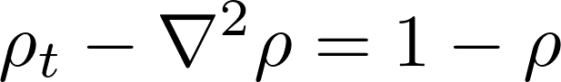
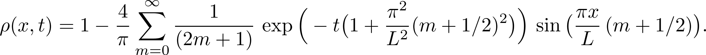
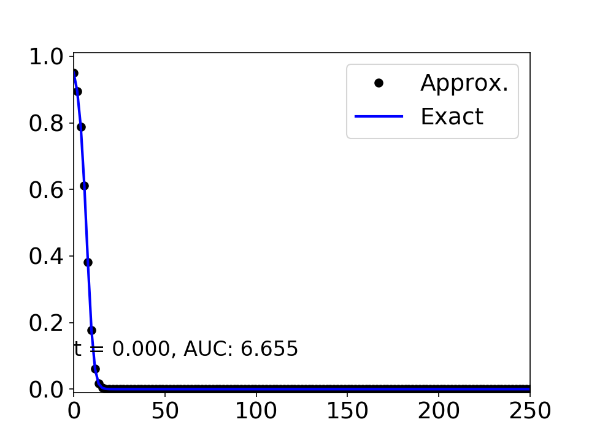

# Alzheimer's model

This is a Python implementation of a solver to a diffusion-reaction partial
differential equation that intends to model the propagation of an infection
throughout the brain. The infection is modeled as a point source.

This project is part of the
[Mathematics in Medicine Program](https://www.houstonmethodist.org/math-in-medicine/)
at the [Houston Methodist Research Institute](https://www.houstonmethodist.org/research/).

## Equation

The model has the form: <br>
 <br>
where &rho;(x,t) denotes the density of the infection in the tissue.
In 1D, for a domain of length L, the analytical solution for the given equation is:<br>


## Videos

Click on the image and download the video to your computer using the download
button to your right.
[](./solution/1D/simulation_and_exact_1D.mp4)


## Usage

To generate the simulation execute the command:

```bash
python3 driver.py
```


